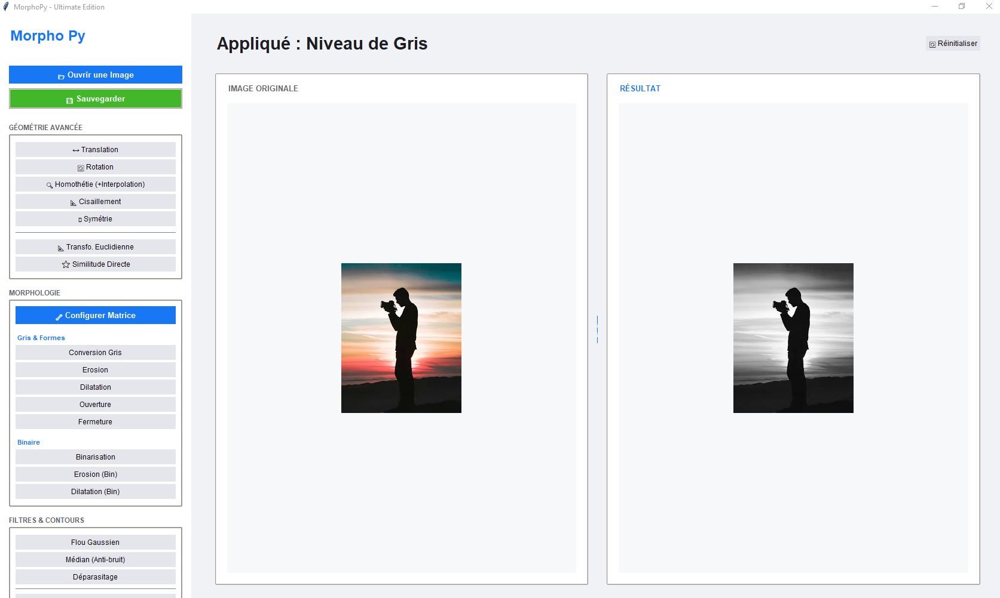

# 🎨 MorphoPy - Ultimate Image Processing Edition

MorphoPy est une application de bureau moderne et intuitive développée en **Python** avec **Tkinter**. Elle permet d'effectuer des opérations avancées de traitement d'images numériques, allant des transformations géométriques simples aux filtres morphologiques complexes.


## ✨ Fonctionnalités

### 📐 Transformations Géométriques
- **Rotation :** Pivotez vos images avec précision.
- **Translation :** Déplacez l'image sur les axes X et Y.
- **Cisaillement (Shear) :** Appliquez des déformations de perspective.
- **Symétrie :** Effets miroirs horizontaux et verticaux.

### 🌑 Traitements de Base & Morphologie
- **Conversion :** Passage rapide en niveau de gris et binarisation.
- **Érosion & Dilatation :** Opérations fondamentales de morphologie mathématique.
- **Ouverture & Fermeture :** Pour le nettoyage du bruit sur les images binaires.
- **Configuration du Noyau :** Personnalisez votre matrice structurante (3x3 ou 5x5) via une interface dédiée.

### 🖼️ Interface Utilisateur (UI)
- Design "Pro Light" inspiré des interfaces modernes.
- Barre latérale de navigation intuitive.
- Zone de prévisualisation dynamique avec redimensionnement automatique.

## 🚀 Installation
1. **Clonez le dépôt :**
   ```bash
   git clone https://github.com/elgomriaya/MorphoPy.git
   cd MorphoPy
2.Installez les bibliothèques requises : Assurez-vous d'avoir Python installé, puis lancez :
   pip install opencv-python Pillow numpy
3.Lancez l'application :
  python main.py


🛠️ Technologies utilisées
Python 3

Tkinter : Pour l'interface graphique (GUI).

OpenCV : Pour la puissance du traitement d'image.

Pillow (PIL) : Pour la gestion et l'affichage des formats d'image.

NumPy : Pour les calculs matriciels des filtres.

📸 Aperçu


✍️ Auteur
Votre Nom - elgomriaya